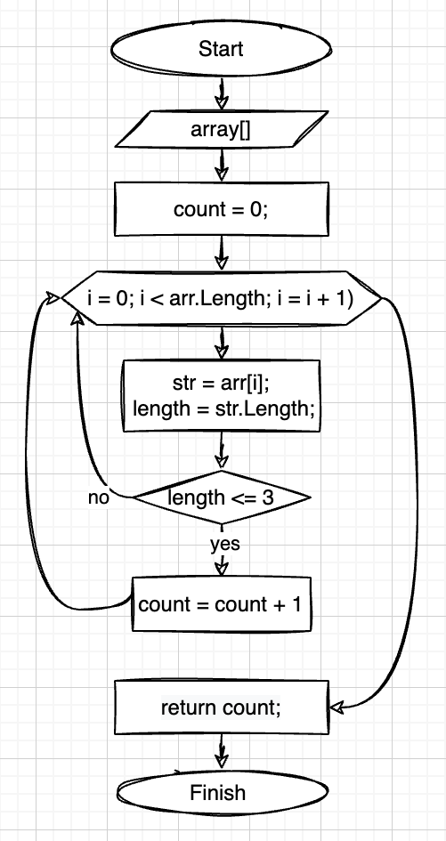
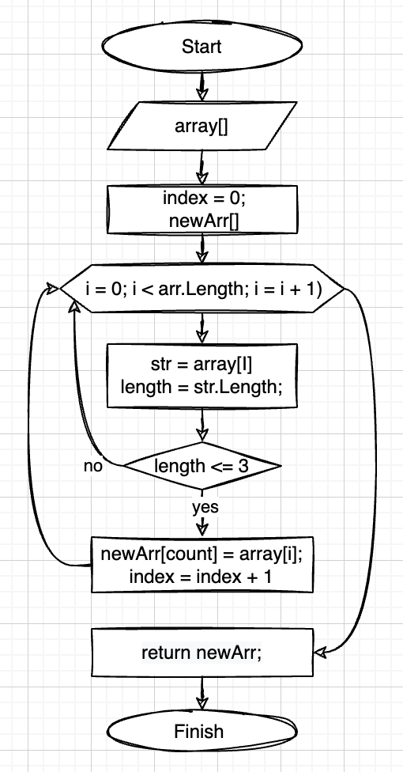

# Итоговая проверочная работа

## Условие

По условию проверочной работы мы должны написать программу, которая из имеющегося массива строк создает массив строк, длина которых меньше или равна трём символам.
Первоначальный массив пользователь должен ввести с клавиатуры, либо задать его на старте выполнения алгоритма.

### Реализация

Сделаем "динамический" вариант программы. Поэтому попросим пользователя ввести элементы массива в терминале ***через пробел***. Сначала нам необходимо выяснить длину результирующего массива. Для этого мы создадим отдельный метод, который возвращает длину массива.

Для лучшего понимания прикладываем блок-схему:



А так реализация выглядит в коде:

```
int NewArrayLength(string[] arr)
{
    int count = 0;
    for (int i = 0; i < arr.Length; i++)
    {
        string str = arr[i];
        int length = str.Length;
        if (length <= 3) count++;
    }
    return count;
}
```

Далее с помощью другого метода можно определить сколько элементов массива имеет длину менее 3-х символов и записать эти элементы в новый массив.

Блок-схема метода:



Реализация метода:

```
string[] FillingNewArray(string[] array, int len)
{
    int index = 0;
    string[] newArr = new string[len];
    for (int i = 0; i < array.Length; i++)
    {
        string str = array[i];
        int length = str.Length;
        if (length <= 3)
        {
            newArr[index] = array[i];
            index++;
        }
    }
    return newArr;
}
```
